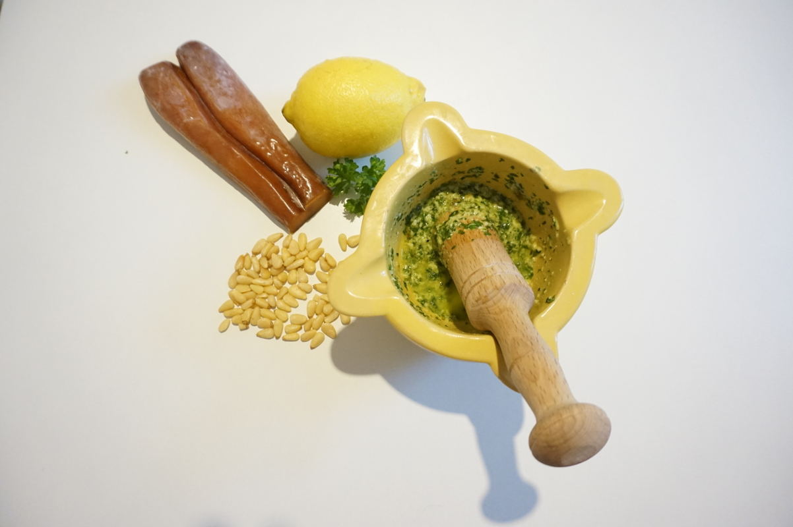

Una ricetta molto semplice ed economica con unico ingrediente pregiato la bottarga di muggine. Il segreto di queste bavette è la qualità degli ingredienti: ottima pasta, una bottarga di qualità, limone bio e prezzemolo fresco e delicato.

 

**Ingredienti per 2 persone:**

- 160 g di bavette grezze di Gragnano
- 1 mazzetto di prezzemolo novello molto fresco
- 1 manciata di pinoli (precedente tostati)
- Scorza di mezzo limone biologico
- 1/4 di aglio
- Bottarga di muggine
- Olio extravergine di oliva
- Sale

**Procedimento:**

In un mortaio iniziate pestando un pezzettino di aglio privato del germe interno, con un pizzico di sale. Successivamente aggiungete il prezzemolo fresco e i pinoli e continuate pestando il tutto fino ad ottenere un composto granuloso. Aggiungete l'olio di oliva poco a poco, pestando riducendo il pesto fine ed omogeneo.

Cuocete la pasta in abbondante acqua salata, scolatela al dente e rimettetela nella pentola. Aggiungete il pesto, mescolate il tutto ed aggiungete all'ultimo la scorza di limone grattugiata.

Servite le vostre bavette con abbondante bottarga gratuggiata.

