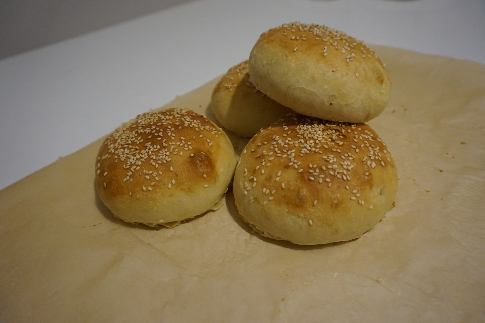
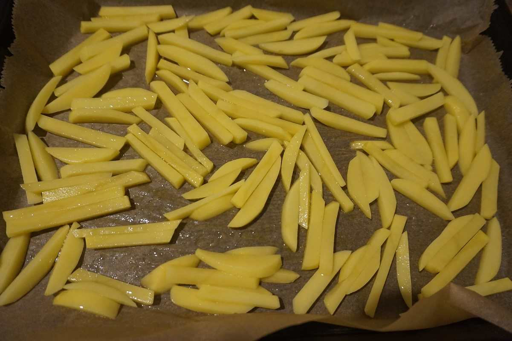
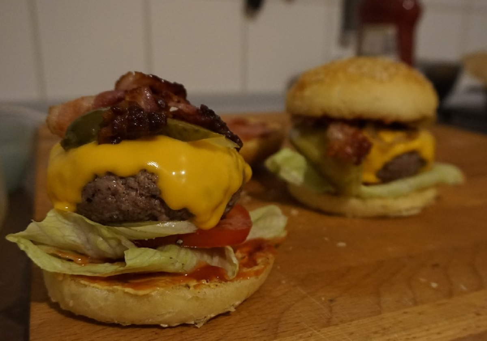

Tutti i trucchi per realizzare il cheeseburger perfetto fatto in casa: dall'impasto per un pane soffice e saporito fino all'importanza della stratificazione.

 

**Ingredienti per 2 panini:**

Per l'impasto:

- 115 g di farina 00
- 1 cucchiaino di zucchero
- 60 ml di acqua
- 3 g lievito secco
- 2 g di sale
- 1 uovo
- Un goccio di olio di semi
- Un goccio di latte
- 10 g di burro sciolto
- Semi di sesamo bianchi

Per il Cheeseburger:

- 260 g di carne macinata di manzo di ottima qualità
- 2 fette di formaggio cheddar
- 4 fette di pomodoro
- 2 foglie di lattuga
- 2 fette di bacon
- 4 cetriolini in salamoia
- Ketchup e senape
- Sale e pepe nero

Per le patatine al forno:

- 4 patate medie
- Sale
- Olio extravergine di oliva e di semi

 

**Procedimento:**

Innanzitutto preparate i panini con gli ingredienti qui indicati e seguendo la [ricetta](https://cucinadalnord.it/pane-per-hamburger-fatto-casa/). Questo sarà il risultato!

Iniziamo preparando le patatine al forno: sbucciate e tagliate le patate a bastoncini cercando di riprodurre la forma delle classiche patatine fritte. Mettete ora le patatine in una ciotola con acqua fredda così perderanno l'amido in eccesso e risulteranno più croccanti. Dopo 5 - 10 minuti scolate bene le patatine e disponete su una teglia da forno, salatele e aggiungete un filo sia di olio di semi sia di olio extravergine di oliva. Cuocete in forno caldo a 190°C per circa 15 - 20 minuti azionando il grill per gli ultimi 3 minuti in modo che le patatine risultino più croccanti.

Togliete la carne dal frigo almeno un'ora prima della preparazione e trasferitela in una ciotola. Aggiungete un pizzico di sale e iniziate ad impastare la carne con le mani in modo da rilassare le fibre e creare una consistenza più uniforme. Dividete l'impasto in 2 e formate con le mani la tipica forma circolare dell'hamburger della stessa dimensione del vostro pane. Quindi realizzate un hamburger sottile e grande per un panino stile "americano" e un hamburger più alto e piccolo per uno stile "moderno". Salate e pepate abbondantemente i due lati degli hamburger, anche i lati; esagerate leggermente con il sale perchè gran parte rimarrà attaccato alla bistecchiera e non renderà così la carne troppo salata.

Preparate i vari ingredienti: il pomodoro a fette leggermente salato, i cetriolini affettati, le foglie di lattuga lavate ed asciugate.

Potete cucinare la carne su una bistecchiera, una padella o ancora meglio sul barbecue. Io ho utilizzato una bistecchiera, scaldatela molto bene e disponete la carne e le fette di bacon accanto. Per un hamburger alto circa 2 cm e una cottura media, cucinate l'hamburger per 2 minuti e mezzo per lato. Passati i primi 2 minuti e mezzo girate l'hamburger sull'altro lato, disponete il formaggio e lasciatelo cucinare per lo stesso tempo. Togliete la carne dal fuoco, ed il bacon quando ben croccante, e lasciatela riposare per 5 - 10 minuti in modo che i liquidi della carne si ridistribuiscano bene e non goccioli sgradevolmente quando addenterete il vostro panino. La carne rimarrà così asciutta ma ben succosa.

Quando il vostro pane sarà pronto e raffreddato, tagliatelo a metà lasciando la base leggermente più alta, e mettetelo sulla bistecchiera in cui avete cotto la carne sul lato interno e lasciatelo scaldare e grigliare per 2 minuti circa. Potete utilizzare le salse che più vi piacciono, io consiglio di spalmare la base con uno strato di senape e la parte sopra con ketchup. Componete ora il vostro cheeseburger, l'alternanza degli strati è molto importante! Disponete sulla base del pane la foglia di lattuga, qualche fetta di pomodoro, l'hamburger con il formaggio, i cetriolini e il bacon, quindi chiudete il tutto. Servite il vostro cheeseburger con le patatine fritte cotte al forno.

