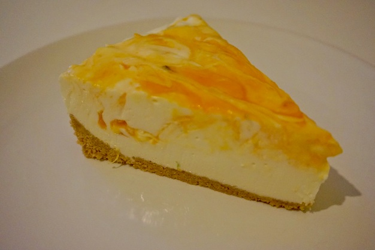

La cheesecake alle albicocche e lime è caratterizzata da contrasti di consistenze, la base bianca compatta in contrapposizione ad una salsa di albicocche molto più liquida, e di sapore in cui si intervalla la pannositá della base all'aciditá della crema.

**Ingredienti per una tortiera di diametro ∅22 cm:**

Per la crema:

- 500 g di formaggio spalmabile
- 200 ml di panna
- 100 g di zucchero a velo
- 10 g di zucchero semolato
- 1 pizzico di sale
- Succo di mezzo limone
- Scorza grattugiata di mezzo lime
- 10 g di gelatina in fogli
- 1/2 bicchiere di latte

Per la base:

- 90 g di biscotti tipo digestive
- 90 g di biscotti secchi semplici
- 60 g di burro

Per la salsa di albicocche:

- 4 albicocche mature
- 2 - 3 cucchiai di zucchero semolato
- 6 foglie di menta fresca
- 0.8 g di gelatina (1/2 foglio)

**Procedimento:**

Mettete i biscotti in un frullatore e tritateli finemente, ora aggiungete il burro freddo e frullate finché tutto il composto si sia omogeneizzato e si sia formata una palla. Rivestite solamente i lati di una tortiera da 22 cm di diametro con delle strisce di carta da forno, per farle aderire meglio ai lati bagnatele leggermente. Quindi trasferite il composto di biscotti nella tortiera e schiacciatelo bene con un cucchiaio fino a creare una base solida ed omogenea, create anche un bordo di 1 cm regolare lungo tutta la circonferenza. Ora mettetelo in frigo a rassodare.

Mettete 10 g di gelatina in ammollo in acqua fredda per 10 minuti. Successivamente strizzate la gelatina dalla sua acqua, aggiungete mezzo bicchiere di latte e scaldate il tutto in un pentolino, facendo sciogliere bene la gelatina; spegnete il fuoco e lasciate che arrivi a temperatura ambiente.

Nel frattempo montate la panna con un frullatore elettrico. In un'altra ciotola aggiungete lo zucchero a velo setacciato, il succo di mezzo limone ed il formaggio spalmabile, frullate anche questo con la frusta elettrica fino ad ottenere un composto morbido e cremoso. Incorporate la panna delicatamente mescolando dal basso verso l'alto con un cucchiaio, aggiungete infine la scorza grattugiata di mezzo lime. Quando la gelatina è arrivata a temperatura ambiente, aggiungetela al composto e mescolate per incorporare il tutto in modo omogeneo. Non versate la gelatina calda altrimenti, a causa dello sbalzo termico, la gelatina si solidificherà all'istante creando fastidiosi grumi. Versate il composto nella tortiera con la base di biscotti.

Preparate ora la salsa di albicocche: innanzitutto lasciate la gelatina in ammollo (1/2 foglio) in acqua fredda per 10 minuti. Poi mettete in un pentolino le albicocche tagliate a metà, 2 o 3 cucchiai di zucchero (regolatevi in base alla dolcezza delle vostre albicocche, optate per un gusto acidulo e rinfrescante) e le foglie di menta. Dopo qualche minuto le albicocche si sfalderanno leggermente e la salsa inizierà ad addensarsi. Frullate la salsa con un frullatore ad immersione e aggiungetevi la gelatina strizzata dalla sua acqua. Mescolate il tutto e lasciate raffreddare.

Una volta che la salsa è arrivata a temperatura ambiente, potete versarla sulla superficie della torta. Potrete semplicemente versarne uno strato omogeneo sopra alla cheesecake oppure aggiungerne delle cucchiaiate all'interno e con l'aiuto di un cucchiaino mescolare i due composti creando un effetto più appariscente e variegato.

L'idea base di questa cheesecake alle albicocche e lime è quella di ottenere una cheesecake fresca e con dei contrasti di consistenze. La base bianca della cheesecake avrà una consistenza solida ma cremosa mentre la salsa di albicocche sarà molto più liquida ed avvolgente mantenendo comunque un effetto compatto.

Lasciare riposare in frigo per almeno 8 ore e servite!

