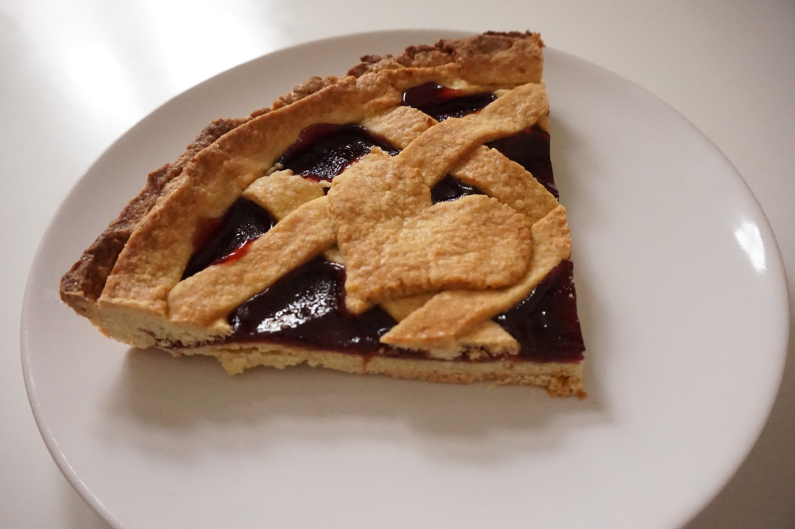

**Ingredienti per una tortiera di 22 cm:**

- 300 g di farina 0
- 150 g di burro
- 105 g di zucchero semolato
- 1 uovo biologico
- 1 pizzico di sale
- Scorza grattugiata di un'arancia biologica
- Marmellata di lamponi q.b.

 

**Procedimento:**

Setacciate la farina in una ciotola, aggiungete un pizzico di sale, lo zucchero e mescolate. Unite quindi il burro molto freddo a tocchetti e amalgamatelo alla farina con la punta delle dita fino a ottenere delle grosse briciole. Aggiungete ora l'uovo e la scorza di arancia e lavorate velocemente in modo che non si scaldi, finché la pasta per la crostata sarà omogenea. Formate una palla, avvolgetela nella pellicola trasparente e lasciala riposare in frigo per mezz'ora.

Rivestite uno stampo per crostate di 24 cm con la carta da forno. Con l'aiuto del mattarello e di farina aggiuntiva, stendete la pasta per la crostata fino ad uno spessore di circa mezzo cm; trasferitela sullo stampo, fate aderire bene e bucherellate il fondo con una forchetta. Con la rimanente pasta create una striscia più spessa da posizionare lungo il bordo, delle strisce più sottili o altri decori da posizionare sopra lo strato di marmellata.

Stendete sulla crostata uno strato di marmellata, aggiungete le strisce di decorazione e cuocete in forno preriscaldato a 180° per 30-35 minuti.

