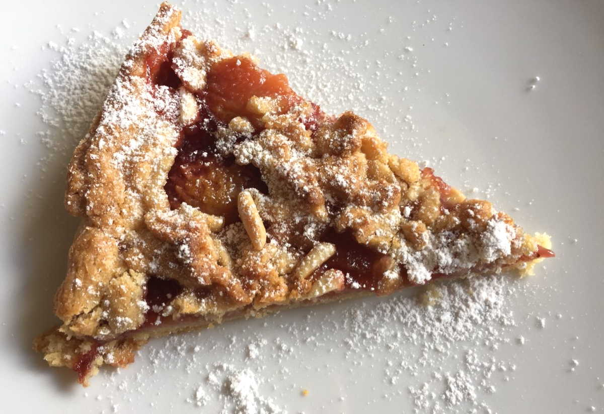

La crostata con prugne fresche e confettura di prugne è un'idea originale e diversa per presentare la classica crostata con la marmellata. I pochi ingredienti che utilizzate dovranno essere di ottima qualità: dal burro, alla farina, alla confettura che non dovrà avere zuccheri aggiunti.

Date un'occhiata anche a questa crostata: [Crostata con marmellata di lamponi](https://cucinadalnord.it/crostata-con-marmellata-di-lamponi/)

**Ingredienti per una tortiera di diametro 24 cm:**

- 300 g di farina
- 150 g di zucchero semolato
- 150 g di burro
- 1 uovo biologico
- 1 pizzico di sale
- Succo di mezzo limone
- 1 cucchiaio di zucchero di canna
- 1 vasetto di confettura di prugne
- 5 prugne grosse mature
- 1 manciata di pinoli

**Procedimento:**

Per prima cosa preparate una pasta frolla veloce: nel mixer mettete la farina, il sale, lo zucchero semolato, il succo di limone, l'uovo e il burro freddo, frullate il tutto fino ad ottenere un composto sabbioso.

Trasferite l’impasto su un piano di lavoro e lavoratelo velocemente con le mani solo per compattarlo, copritelo con la pellicola trasparente e lasciatelo in frigo per almeno mezz'ora. Successivamente dividete l'impasto: riponete i 2/3 nel frigo e trasferite 1/3 in congelatore.

Nel frattempo tagliate le prugne fresche a fette sottili.

Stendete con un mattarello i 2/3 dell'impasto e disponetelo su una tortiera di diametro 24 cm; spalmate la base con la confettura di prugne e successivamente disponete le prugne fresche in modo ordinato.

Prendete ora il panetto di pasta dal congelatore ed aiutandovi con una grattugia a fori grandi, fate cadere le scaglie di pasta sopra le prugne (potete utilizzare anche uno schiacciapatate).

Spolverizzate la superficie della crostata di prugne fresche con un cucchiaio di zucchero di canna ed una manciata di pinoli. Cuocete in forno caldo a 180° per 45 minuti circa.

