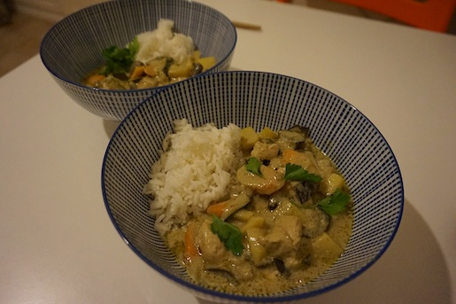

**Ingredienti per 2 persone:**

- 400 ml di latte di cocco
- 1 melanzana piccola
- 1/2 zucchina
- 1 carota
- 1 cipolla
- 1 patata
- 4 funghi champignon
- 2 cucchiai di pasta di curry verde
- 4 foglie di lime
- 100 g di riso jasmine
- 2 cucchiai di olio di semi
- Coriandolo fresco
- 100 g di petto di pollo (a piacere)
- Lime fresco
- 2 cucchiai di salsa di pesce (sostituitela con del semplice sale per la versione vegetariana)
- 1 cucchiaio di zucchero

La pasta di curry verde è un preparato tipico della cucina thailandese costituito da: peperoncini verdi freschi, lemongrass, aglio, scalogno, sale, galangal, cumino e semi di coriandolo.

La potete trovare in qualsiasi supermercato asiatico ben fornito, io utilizzo generalmente questa pasta di curry.
 

**Procedimento:**

Iniziate con la preparazione delle verdure. Pelate le patate e tagliatele a piccoli cubetti in modo che si possano cucinare in 20 minuti circa. Pelate anche le carote e tagliatele diagonalmente spesse circa 0.5 cm. Tagliate allo stesso modo anche la zucchina. Tagliate le melanzane a fette e poi in quattro, i pezzi dovranno risultare parecchio grandi. Tagliate la cipolla in 4 pezzi e sfogliatela leggermente. Tagliate anche i funghi in quattro parti ed il pollo a cubetti.

Cucinate il riso in acqua bollente salata, seguendo le indicazioni sulla confezione.

Scaldate il wok con 2 cucchiai di olio di semi e aggiungete la pasta di curry, scaldate bene finché il curry inizia a rilasciare tutti i suoi profumi. Aggiungete poco a poco il latte di cocco, dissolvendo la pasta di curry all'interno e creando una salsa omogenea. Strappate la nervatura centrale alle foglie di lime e aggiungetele alla salsa.

Non appena il latte di cocco prende il bollore, procedete alla cottura delle verdure in modo graduale a fuoco medio. Aggiungete inizialmente le patate e le carote, trascorsi 5 minuti aggiungete le melanzane e la cipolla. Dopo altri 5 minuti aggiungete le zucchine ed il pollo tagliato a cubetti. Dopo altri 5 minuti i funghi tagliati in quattro. Lasciate sobbollire per 10 - 15 minuti a fuoco medio-alto e successivamente per 5 minuti a fuoco basso.

Le verdure dovranno risultare cotte ma ancora al dente e la pasta di curry dovrà essere lucida e dovrete poter notare che l'olio naturale intrinseco della pasta di curry si sia separato creando delle goccioline verdastre.

Ultimata la cottura aggiungete un cucchiaio di zucchero, 2 cucchiai di salsa di pesce e abbondante lime. Servite ben caldo con foglie di coriandolo fresco e riso.

