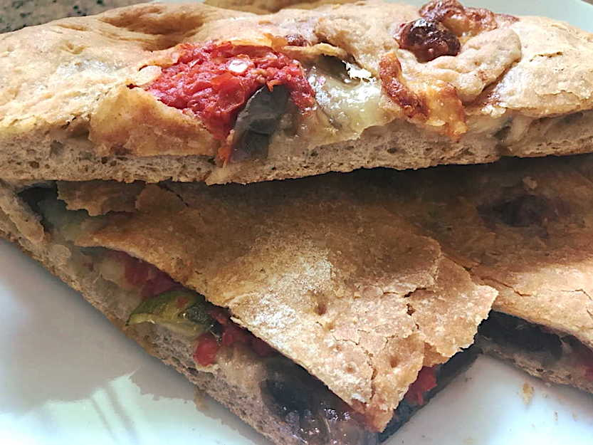

Questa focaccia alla norma è caratterizzata da un ripieno di melanzane fritte, pomodoro e mozzarella di bufala ed un impasto realizzato in parte con farina integrale. Una ricetta perfetta per l'estate da servire calda a cubotti ma molto buona anche fredda per un pic-nic.

Qui vi lascio un'altra ricetta per una focaccia deliziosa: [Focaccia sottile allo stracchino](https://cucinadalnord.it/focaccia-sottile-allo-stracchino/)

**Ingredienti per 4 persone:**

Per l'impasto:

- 250 g di farina 0
- 100 g di farina integrale
- 500 g di acqua circa (la dose può variare in base alla farina)
- 6 g di lievito di birra in polvere
- 1 pizzico di zucchero
- 1/2 cucchiaino di sale

Per il ripieno:

- 1 grossa melanzana ovale
- 5 cucchiai di sugo di pomodoro
- 1 mozzarella di bufala
- 4 cucchiai di formaggio grana grattugiato
- Basilico fresco
- Olio extravergine di oliva
- Sale
- Olio di semi di arachidi per friggere

**Procedimento:**

Per prima cosa preparate l'impasto per la focaccia alla norma, ricordate che poco lievito e tempi di lievitazione lunghi farranno in modo che la focaccia risulti più morbida e digeribile. In un recipiente fate sciogliere il lievito e lo zucchero nell’acqua tiepida. Aggiungete le farine setacciate e mescolate il composto con un cucchiaio di legno, aggiungete poi il sale e trasferite l’impasto su una spianatoia. Lavorate l’impasto per 10 minuti finché sarà elastico, ripiegando la pasta su se stessa ed incorporando aria. Formate una palla e mettetela nella terrina ungendola con olio, incidete la superficie del panetto formando una croce e lasciate lievitare coperto da pellicola in un luogo tiepido e riparato.

Dopo un’ora sgonfiate l’impasto e rimpastatelo lasciandolo nel recipiente. Si può ripetere questa operazione per un paio di volte, ottenendo così un impasto più leggero e digeribile.

Nel frattempo tagliate la melanzana a fette sottili e friggetele in olio di semi.

Riprendete l'impasto e dividetelo: i 2/3 li utilizzerete per la base ed 1/3 per la copertura. Stendete i 2/3 dell'impasto e trasferitelo su una teglia ricoperta di carta da forno. Disponeteci sopra le fette di melanzane, successivamente le fette di mozzarella precedentemente sgocciolate, il sugo di pomodoro, il formaggio grana e le foglie di basilico.

Stendete ora l'impasto rimanente in uno strato più sottile ed adagiatelo sopra al ripieno, sigillatene bene i bordi e bucherellate la superficie con una forchetta. Infine spennellate la superficie con olio extravergine di oliva ed infornate in forno caldo a 200°C per 30 minuti. Una volta cotta, il fondo della vostra focaccia sarà ben dorato e la superficie croccante.

