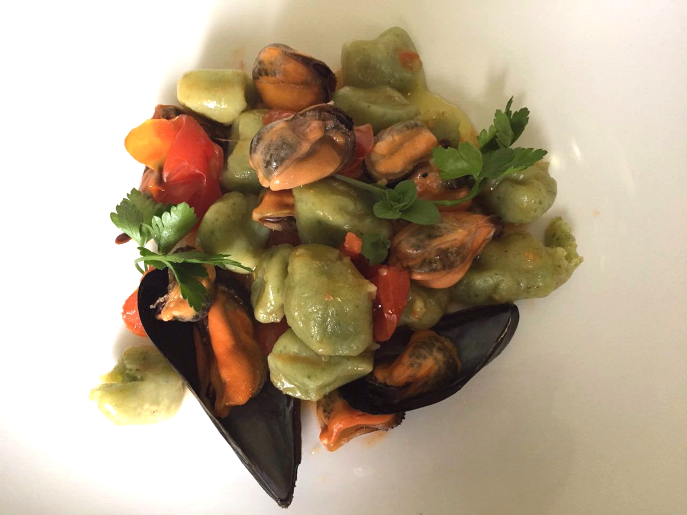

Il Selene, anche chiamato Sciopeti o Carletti, è un'erba spontanea tipica del periodo primaverile caratterizzata in maturazione da piccoli fiori bianchi.

Il gusto è delicato e leggermente sapido, per me perfetto come abbinamento al sapore minerale e salino delle cozze.

 

**Ingredienti per 4 persone:**

- 1 kg di patate gialle per gnocchi
- 300 g di farina 0
- 1/2 kg di erba Selene
- 1 kg di cozze
- 1/2 scalogno
- 1 spicchio di aglio
- 15 pomodorini ciliegino
- 3 rametti di prezzemolo
- Olio extra vergine di oliva
- Sale

 

**Procedimento:**

Lessate le patate intere partendo da abbondante acqua fredda per circa 40 minuti. Fate la prova con la forchetta, se i rebbi entrano senza difficoltà le patate sono pronte. Scolatele, sbucciatele e schiacciatele ancora calde.

Nel frattempo lavate il selene e sbollentatelo per pochi minuti in acqua bollente e scolatelo. Preparate un soffritto con mezzo scalogno tritato ed un goccio di olio, aggiungete il selene e ripassatelo in padella. Appena pronto, frullate il selene ed aggiungetelo alle patate schiacciate.

L'impasto degli gnocchi sarà realizzato con le patate schiacciate, il selene frullato, 1/2 cucchiaino di sale e la farina; impastate bene il tutto fino ad ottenere un composto omogeneo e compatto.

Preparate con l'impasto dei filoncini rotondi di un centimetro di diametro, tagliateli a pezzetti ed infarinateli bene. Potete rigarli facendoli passare sui rebbi della forchetta oppure lasciarli semplicemente lisci. Sistemateli su un vassoio infarinato e copriteli con un canovaccio così non si seccano.

Pulite le cozze e fatele aprire in una padella larga con uno spicchio di aglio schiacciato ed un goccio di olio, saranno necessari solo pochi minuti di cottura con coperchio in modo che rimangano ben morbide e succose. Private le cozze della conchiglia e lasciatele in una ciotola coperte dalla pellicola trasparente così rimarranno calde e morbide.

Filtrate ora il liquido delle cozze e riaggiungetelo nella padella.

Tagliate i pomodorini a metà e disponeteli in un'altra padella  con un filo di olio con la parte tagliata verso il basso, aggiungete un pizzico di sale se necessario e qualche erbetta aromatica a vostro piacere, cuocete a fuoco vivace. I pomodorini rimarranno così interi e ben saporiti.

Cuocete infine gli gnocchi in abbondante acqua salata, non appena verranno a galla scolateli nella padella con il liquido delle cozze, mescolate bene il tutto con una spatola di silicone.

Aggiungete infine i pomodorini, le cozze e servite!

