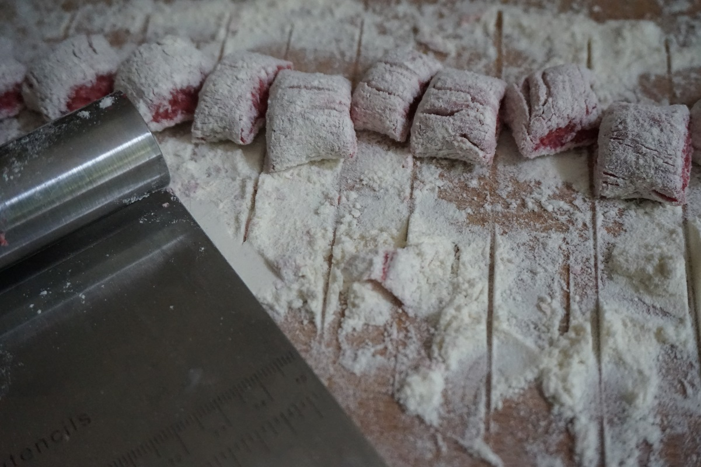

**Ingredienti per 3 persone:**

- 4 patate (400 g)
- 2 rape rosse precotte
- 200 – 250 g di farina 00
- ½ cucchiaino di noce moscata
- Un pezzetto di gorgonzola dolce
- 1 goccio di latte
- 7 noci tritate
- Sale e pepe nero

 

**Procedimento:**

Lessate le patate intere in abbondante acqua salata per circa 30 – 40 minuti. Scolatele e schiacciatele ancora calde con lo schiaccia patate, trasferitele in una ciotola. Sbucciate le rape rosse precotte e frullatele fino a diventare un composto liscio ed uniforme. Trasferitele nel composto di patate ed aggiungete ½ cucchiaino di noce moscata e sale; assaggiate e regolate a vostro piacimento.

Iniziate ad aggiungere la farina incorporandola alle patate e alle rape fino a che il composto sarà lavorabile con le mani, non aggiungete eccessiva farina altrimenti gli gnocchi risulteranno troppo duri. Realizzate dei rotolini e tagliate gli gnocchi a piccoli tocchetti.

Sciogliete il gorgonzola a pezzetti con un goccio di latte, salate leggermente e pepate. Tuffate gli gnocchi in abbondante acqua salata, appena verranno a galla scolateli e aggiungeteli alla salsa di gorgonzola, mescolate il tutto bene finché la salsa si addensa e lacca gli gnocchi. Servite con abbondante pepe nero macinato al momento e qualche noce tritata.

