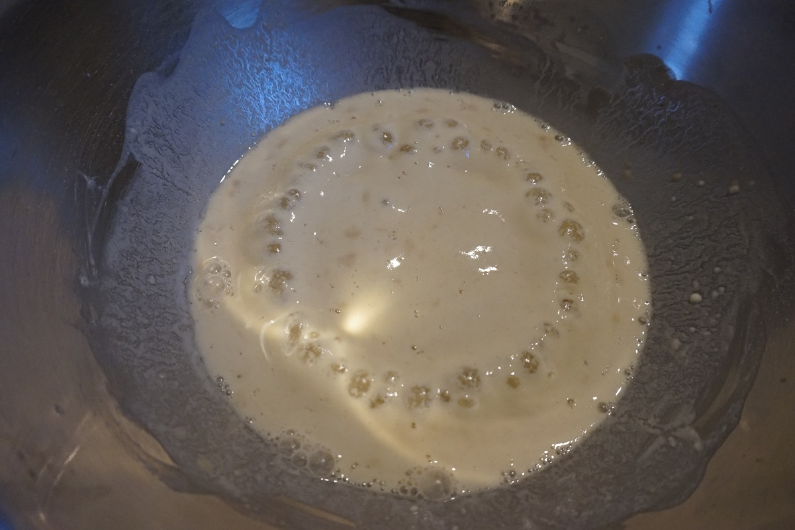

**Ingredienti per 8 panini:**

- 450 g di farina 00
- 4 cucchiaini di zucchero
- 235 ml di acqua
- 7 g lievito secco
- 7 g di sale
- 2 uova
- Un goccio di olio di semi
- Un goccio di latte
- 40 g di burro sciolto
- Semi di sesamo bianchi

 

**Procedimento:**

Mettere in una ciotola il lievito, 60 g di farina e l'acqua calda e mescolate finché omogeneo. Lasciate riposare 30 minuti in modo che inizi la lievitazione, si formeranno delle piccole bollicine come nella foto qui sotto.

Aggiungere un uovo, il burro fuso raffreddato, lo zucchero, il sale e la restante farina setacciata. Mescolate il tutto inizialmente con una forchetta e poi con le mani, il composto deve essere piuttosto appiccicoso quindi lavoratelo rapidamente e con le mani fredde per circa 10 minuti. Formate una palla, oliate la ciotola con olio di semi, e rigiratevi la palla finché risulti oliata su tutta la superficie. Coprite con la pellicola trasparente e lasciate lievitare per 2 ore in un luogo caldo.

Trascorse le 2 ore, trasferite l'impasto su una spianatoia infarinata, schiacciate la pasta con le dita formando una rettangolo. Tagliate quindi 8 pezzi di uguale peso ed impastate ogni pezzo singolarmente, ripiegandolo su sé stesso e formando alla fine una pallina.

Se preferite ottenere un hamburger grande "stile americano", quindi più grande e appiattito, schiacciate le palline con la punta delle dita allargandole fino ad un diametro di circa 8 cm (come nelle foto). Altrimenti se volete realizzare degli "hamburger moderni" quindi più piccoli e alti, allargate solo leggermente le palline, molto poco perché durante la seconda lievitazione raddoppieranno di volume e si allargheranno.

Trasferite i vari paninetti su una teglia ricoperta da carta forno, spolverizzate la superficie con della farina, appoggiateci sopra un foglio di pellicola trasparente e lasciate riposare per un'altra ora. Preriscaldate il forno a 190°C. In una ciotolina sbattete l'uovo con un goccino di latte, spennellatelo delicatamente sulla superficie dei panini con l'aiuto di un pennello da cucina. Aggiungetevi sopra i semi di sesamo bianchi.

Infornate il vostro pane da hamburger per 15 - 17 minuti a 190°C. Lasciate raffreddare completamente prima di tagliarli e farcirli con il vostro hamburger!

