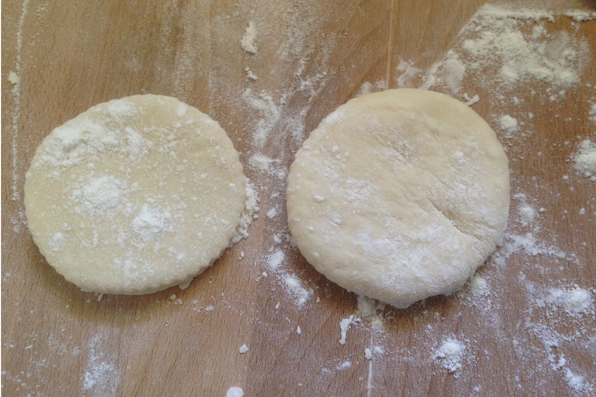
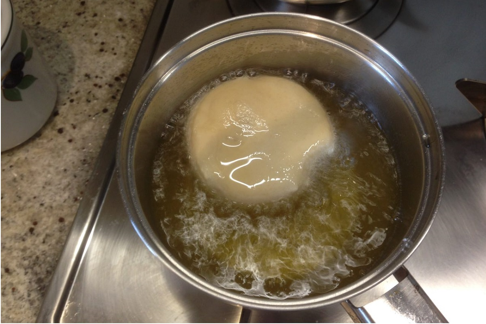

**Ingredienti:**

- 250 gr farina 00
- 125 gr latte intero
- 3 gr lievito secco
- 5 gr sale
- 1 pizzico di sale
- Olio di semi per friggere
- Petto di pollo
- Rosmarino sale pepe
- Insalatina fresca

 

**Procedimento:**

Sciogliere il lievito nel latte tiepido aggiungere un pizzico di zucchero, la farina infine il sale. Impastare per 10 minuti formare un palla liscia e lasciare lievitare in una terrina coperta dalla pellicola per due ore. Riprendere l'impasto e con delicatezza stenderlo in un rettangolo di 1\2 cm di spessore, tagliare con un coppa-pasta dei cerchi di 6 o 7 cm di diametro e lasciarli lievitare ancora coperti dalla pellicola per un' oretta. Tagliamo il petto di pollo a striscioline e lo cuociamo in una pentola antiaderente, sale pepe e il rosmarino, lo mettiamo in un piatto con un goccio d'olio e erbe aromatiche a insaporire. Scaldiamo l'olio di semi in un pentolino profondo e cuociamo i panini a fuoco medio e girandoli un paio di volte.
 

Vanno infine tagliati e riempiti con il pollo e l'insalatina; sono ottimi anche con il roast beef e i sottaceti o con l'arrosto avanzato del giorno prima.

