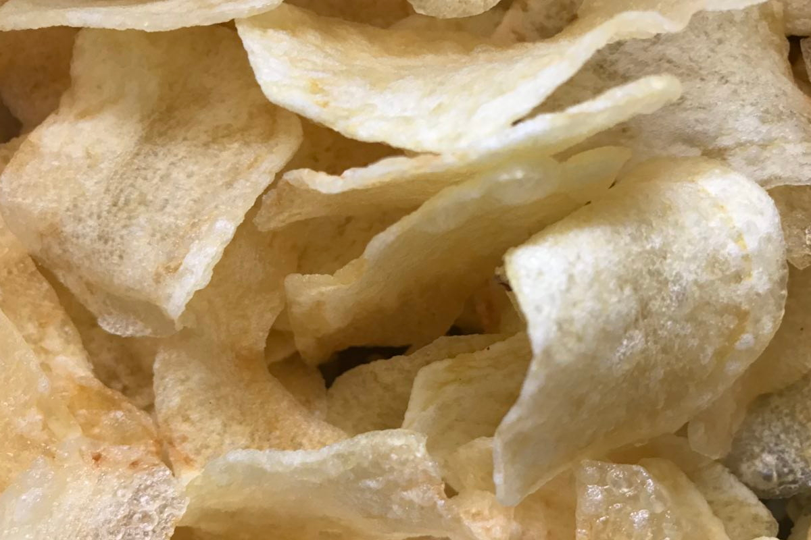

Queste patatine chips sono buone come aperitivo con un buon bicchiere di vino o come contorno. Si possono preparare con un po' di anticipo perché si mantengono ben croccanti anche fredde. Preparerete delle chips buone, croccanti e senza conservanti, ottime anche per i bambini.

 

**Ingredienti:**

- Ottime patate di montagna
- Sale grosso
- Sale fino
- Olio di arachidi per friggere

 

**Procedimento:**

Sbucciate le patate e lavatele sotto l'acqua bollente, lasciatele in acqua bollente intere per 2 minuti. Tagliate dei sottili petali di patata con una mandolina e metteteli in una ciotola con acqua molto fredda. Scolatele e sciacquatele bene ancora con acqua fredda in modo che perdano l’amido.

Trasferite ora le vostre patate in una ciotola con acqua fredda con alcuni cubetti di ghiaccio e un cucchiaio di sale grosso. Lasciatele nell’acqua fredda in frigorifero per un'oretta (potete lasciarle così anche un giorno intero). Scolate quindi le patate e asciugatele bene.

Scaldate in una friggitrice l'olio di semi di arachidi, quando sara ben caldo aggiungete le patatine nel cestello e friggete per circa 15 minuti, vedrete che le vostre chips cambieranno colore e si accartocceranno. Scolatele bene e adagitele sulla carta assorbente; salate prima di servire e buon appetito!

Queste chips sono buone tiepide ed ottime anche fredde.

