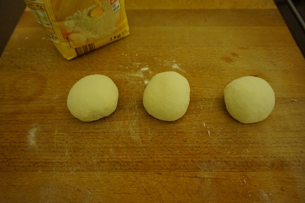

**Ingredienti per 3 piadine (2 persone):**

- 180 g di farina 00
- Olio extravergine di oliva
- Sale q.b. (3-4 presine)
- Zucchero (1 presina)
- Acqua calda q.b.

 

**Procedimento:**

Versate in una terrina la farina setacciata,  il sale, lo zucchero e l'olio. Aggiungete poco a poco l'acqua tiepida fino ad ottenere un impasto lavorabile con le mani.

Dividete l'impasto in 3 parti e preparate, lavorando ogni impasto, 3 palline di circa 90 - 100 g ognuna e lasciatele riposare su una spianatoia infarinata per 30 minuti  ricoperte da un foglio di pellicola trasparente.

Stendete le 3 palline con un mattarello, fino ad ottenere una sfoglia sottile di forma circolare. Cucinate quindi le piadine in una padella antiaderente ben calda qualche minuto per lato, finché risultino colorate con le caratteristiche macchine bruciacchiate della piadina romagnola.

Farcitele con quello che più vi piace!

