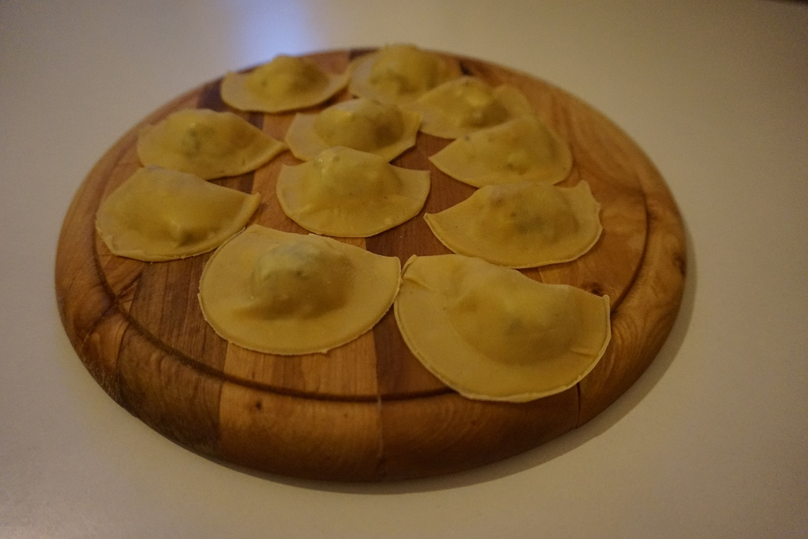

**Ingredienti per 2 persone (piatto leggero):**

- 95 g di farina
- 1 uovo grande
- 1/4 cucchiaino di sale
- 1 pera abate (200gr)
- 50 g circa di gorgonzola dolce
- Burro
- Sale e pepe nero
- 4 cucchiai di formaggio grana grattugiato
- 10 noci tritate

 

**Procedimento:**

Preparate la pasta all'uovo con 90 g di farina, 1 uovo e 1/4 cucchiaino di sale seguendo il procedimento che trovate [qui](https://cucinadalnord.it/pasta-fresca-uovo/).

Scaldate in una padella una noce di burro e aggiungere le pere tagliate a piccoli cubetti. Lasciare cucinare per circa 5-10 minuti finché risultino un po' caramellate, aggiungete sale e pepe.

Stendete la pasta in strisce molto sottili, se usate la nonna papera al numero 7, e posizionate mezzo cucchiaino di pere e un cubetto da 0,5 cm di gorgonzola al centro della pasta a distanza regolare. Bagnate i lati della pasta con dell'acqua e ripiegate un lembo della pasta sopra all'altro facendo attenzione ad eliminare tutta l'aria all'interno. Sigillateli bene e tagliateli a mezza luna con l'aiuto di un coppa pasta.

Tuffate i ravioli in acqua bollente salata per 2 minuti, trasferiteli ora in una padella in cui avrete scaldato due noci di burro. Lasciate i ravioli umidi aiutandovi con l'acqua di cattura, aggiungete il formaggio grana grattugiato e mescolate fino a creare una cremina. Servite con una macinata di pepe nero e delle noci tritate.

