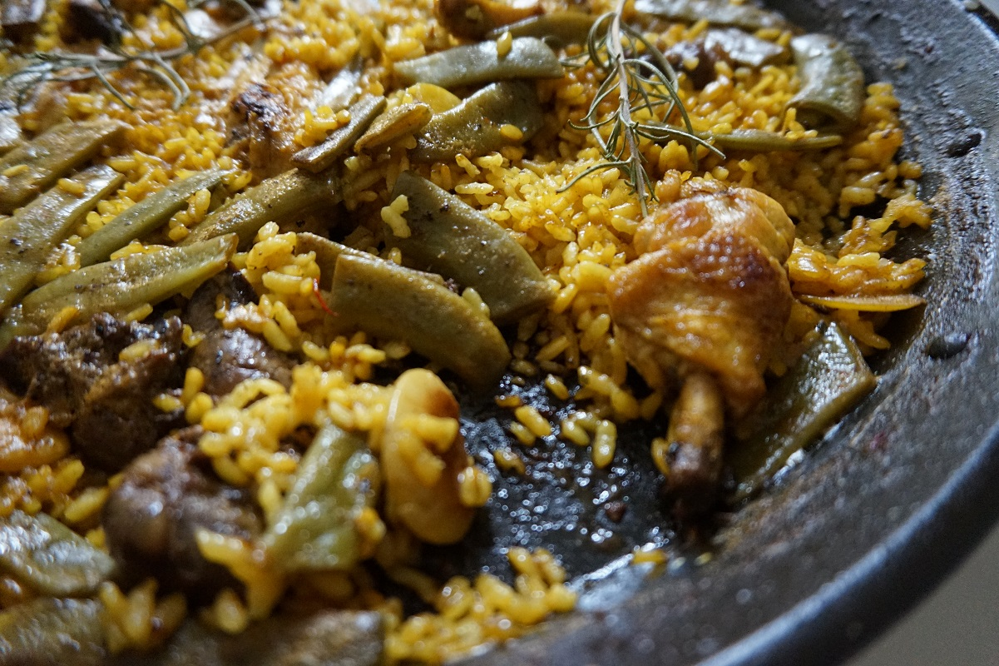

Il Riso al Forno, arroz al horno o Arros al forn (come se dice in la lingua originale) e un piatto tradizionale de la cucina Valenciana.
Questo piato viene solitamente cuoto in una teglia di terracota e mangiato il weekend in famiglia.
Ancora ricordo la prima volta che l'ho assagiato a Valencia. Ha stato durante le feste di Natale, la ciotola di terracota era in il mezzo dil tavolo e quella persona che serviva, chiedeva a ogni persona che ingredienti volevano. In ogni famiglia e diverso, ma solitamente il pomodoro e la patata vengono tanto appreziati.

 

**Ingredienti per 4 porzioni:**

- 350g di Riso bomba
- 4 morcillas
- 500g costicine di maiale
- 700ml di brodo di carne
- 1 pomodoro cuore di bue (o una grande)
- 2 patate
- 1 testa di aglio
- 2 cucchiai di pasata di pomodoro
- 2 cucchiai di paprica afumicata (pimenton)

**Procedimento:**

Iniziate sbuciando le patate e tagliando a rondelle di 1.5 - 2cm di spessore (grosse). Pulite il pomodoro e taglitatelo grosso come la patata. Prendete la testa di aglio e sbuciatela un po, di manera que ogni dente si veda bene.
Adesso coprite una padella grande con olio di olive extra vergine. Fatte friggere la testa di aglio per 3 o 4 minuti. Continuate marcando la patata per ogni lato (2 o 3 min per lato) e dopo le fete di pomodoro (2 minuti per lato).

Adesso su una teglia de terracota si ce la avete (su una teglia normale da forno se no) marcate le costicine di maiale, e dopo le morcillas. Riservatele.
La teglia abra un po di grassa dil maiale, lascitela la. Su quella teglia, metete 2 cuchiai di pasata di pomodoro e fate friggere per 2 minuti. Adesso aggiungete il riso e farlo tostare per altri 2 o 3 minuti. Si avete un po' di zafferano potete agiungerlo come si fa a Valencia.

Scaldate il forno a 210 gradi. Togliete la teglia dil fuoco, spalmate il riso e agiungiete facendo una bella composizione le costicine, morcillas, pomodoro e patata. Metete la testa di aglio in centro premendola fino que tochi la base di la teglia.
Adesso agiungete il brodo (e tanto importante che la proporzione di brodo sia 2 volte la di riso) e metete la teglia in il forno a altezza mezza.
Fate cucinare per 25 minuti o fino a che il brodo e stato assorbito dal riso.

Fate riposare qualche minuto e servitelo in mezzo dil tavolo come si fa a Spagna.

