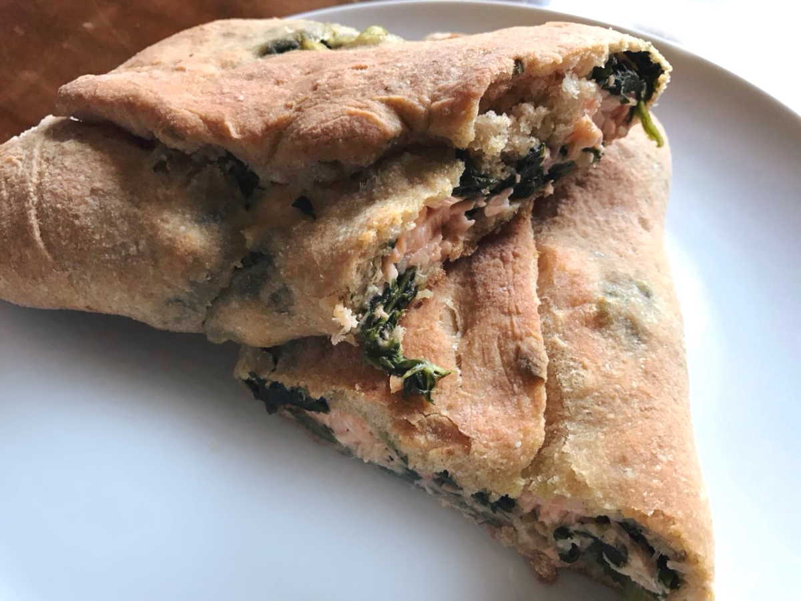

Il salmone in crosta di pane con spinaci è una ricetta estiva, divertente da preparare e gustosa. Potete accompagnare questo piatto con un'insalata fresca, dello yogurt naturale ed alcune gocce di limone.

 

**Ingredienti per 4 persone:**

Per l'impasto:

- 6 cucchiai di farina 0
- 3 cucchiai di farina integrale
- 1 pizzico di zucchero
- 1/2 cucchiaino di sale
- Foglie fresche di maggiorana
- 3 g di lievito di birra secco
- 100 ml di acqua

Per il ripieno:

- 3 fette di salmone
- Foglie fresche di timo
- 200 g di spinaci surgelati
- 1 spicchio di aglio
- 20 g di burro
- Olio extravergine di oliva
- Sale e pepe bianco

 

**Procedimento:**

Per prima cosa preparate l'impasto: sciogliete il lievito e lo zucchero nell'acqua, aggiungete le foglie di maggiorana spezzettate, successivamente incorporate le farine setacciandole ed infine salate. Mescolate bene il tutto prima con una forchetta e successivamente impastate su una spianatoia, ottenendo un composto liscio ed omogeo. Trasferite l'impasto in una ciotola, copritelo con la pellicola trasparente e lasciate lievitare per almeno 2 ore, finché l'impasto sia raddoppiato in volume.

Eliminate pelle e lische dal salmone, tagliate ogni fetta in 4 pezzi e trasferitelo in un recipiente ed insaporitelo con sale, pepe, timo ed un goccio di olio extravergine di oliva. Lasciate il salmone in questa marinatura per qualche ora in modo che si insaporisca bene.

Preparate gli spinaci, facendo insaporire il burro con lo spicchio di aglio schiacciato in una padella, aggiungete gli spinaci ancora surgelati, salate e portate a cottura.

Quando l'impasto sarà ben lievitato, dividetelo in due e tiratelo ben sottile con l'aiuto del mattarello formando due rettangoli. Su ogni rettangolo di pasta, disponete uno strato di spinaci, il salmone e richiudete bene il rotolo; spennellate infine la superficie con olio di oliva. Cuocete i rotoli di salmone in forno a 200°C per 20 minuti.

Potete servire il salmone in crosta di pane con dello yogurt bianco o qualche goccia di limone.

