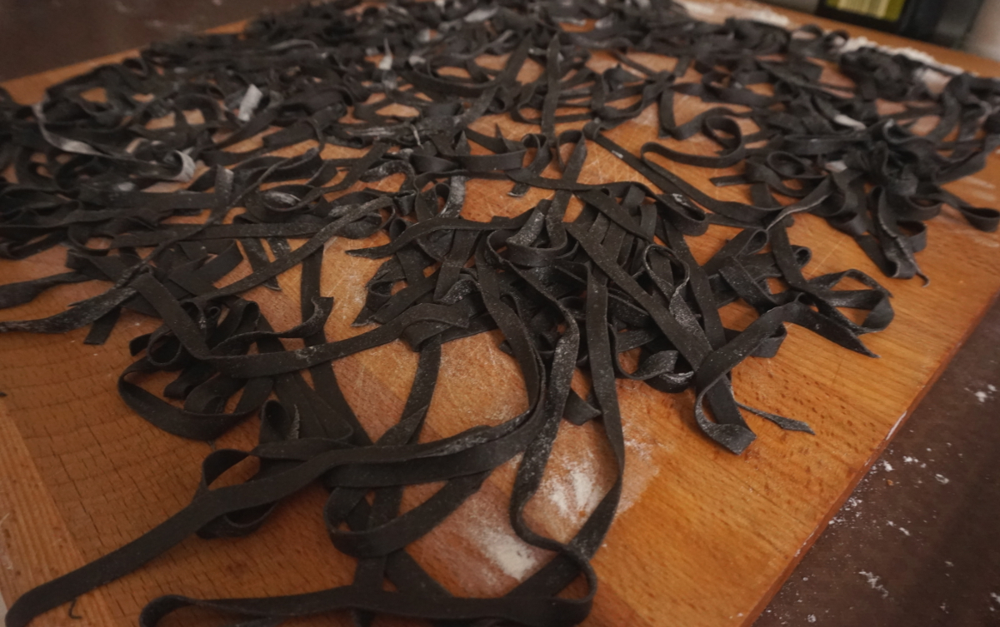

Le tagliatelle al nero di seppia con sugo di triglie sono un primo piatto molto scenografico e saporito. Con il solo utilizzo del nero di seppia potrete realizzare dei piatti molto originali da presentare ai vostri invitati. Il procedimento di questa ricetta è un po' complesso e richiede differenti preparazioni però credetemi, ne varrà la pena!

 

**Ingredienti per 2 persone:**

Per la pasta:

- 180 g di farina 0
- 2 uova biologiche
- 1 pizzico di sale
- 4 g di nero di seppia

Per il sugo ed il fumetto di pesce:

- 2 triglie di scoglio
- 1 carota
- 1 cipolla
- 1/2 costa di sedano
- 2 foglie di lime
- Pomodorini ciliegino freschi o conservati
- 1 peperoncino secco
- 1 spicchio di aglio
- Olio extravergine di oliva
- Sale e zucchero

 

**Procedimento:**

Iniziate con la preparazione della pasta: procedete disponendo la farina setacciata a fontana, nel centro aggiungete le 2 uova, il nero di seppia ed il sale. Iniziate a sbattere le uova con una forchetta molto energicamente ed iniziate ad incorporare la farina poco a poco. Successivamente iniziate ad impastare con le mani fino ad ottenere un composto liscio ed omogeneo. Infarinate la pallina di pasta ottenuta, avvolgetela nella pellicola trasparente e lasciatela riposare per 30 minuti. Stirate la pasta a mano o con la nonna papera fino al numero 6 e preparate le tagliatelle.

Prepariamo le triglie: per prima cosa squamate le triglie, con una forbice tagliate le pinne. Fate un'incisione longitudinalmente sullo stomaco per eliminarne gli organi interni e lavatele bene sotto acqua corrente. Prelevate i due filetti con un coltello da pesce e lasciateli da parte. Ho pensato di servire un filetto per persona ed utilizzare i due filetti rimanenti per il sugo. Tagliate quindi a pezzetti 2 filetti di triglia per il sugo.

Per il fumetto di pesce scaldate dell'olio di oliva in un pentolino, aggiungete le teste e le lische del pesce che avrete ben lavato, la carota, la cipolla ed il sedano a tocchetti grandi. Tostate bene il tutto, in modo da far caramellizzare bene il fondo, quindi salate ed aggiungete un bicchiere di acqua fredda, non troppa perché non abbiamo bisogno di molto fumetto bensì poco e concentrato. Ho aggiunto quindi le foglie di lime private della nervatura principale e pigate con le mani, per rilasciare profumi ed olii essenziali, per conferire a questo fumetto un sapore più fresco e meno "pescioso". Portate ad ebbollizione e spegnete, il fumetto è pronto.

Realizzate un sughetto di pomodorini veloce: in una padella larga scaldate dell'olio extra vergine di oliva ed aggiungete uno spicchio di aglio schiacciato, profumate l'olio senza bruciarlo, aggiungete il peperoncino sbriciolato e le triglie a pezzetti. Rosolate il pesce, togliete l'aglio ed aggiungete i pomodorini. Salate ed aggiungete eventualmente un pizzico di zucchero per bilanciarne l'acidità. Aggiungete il fumetto di pesce e lasciate che si riduca leggermente.

In una padella scaldate un goccio di olio di oliva, quando sarà ben caldo aggiungete i filetti di triglia con la parte della pelle verso il basso per 2 minuti; salate e rigirate il filetto per 30 secondi quindi lasciatelo da parte. La pelle delle triglie dovrà risultare ben croccante.

Tuffate le tagliatelle in acqua bollente salata, scolatele dopo 2 minuti e trasferitele nella padella con il sugo di pomodorini. Amalgamate bene il tutto con l'aggiunta di acqua di cottura nel caso fosse necessario.

Servite quindi le vostre tagliatelle ben calde con sopra il filetto di triglia croccante.

