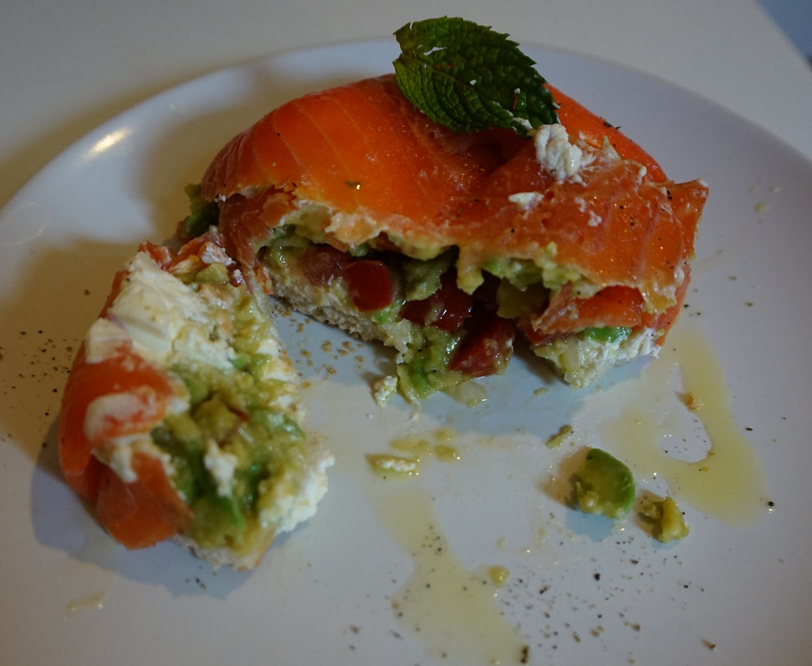

**Ingredienti per 2 persone:**

- 1 avocado maturo
- 1 pomodoro
- 100 g di salmone affumicato
- Formaggio fresco spalmabile
- 2 fette di pane
- Basilico
- Sale e pepe nero
- Limone
- Olio extravergine di oliva

 

**Procedimento:**

Rivestite due copettine con un foglio di pellicola trasparente e ricopritele con le fette di salmone affumicato sulle quali avrete spalmato uno strato di formaggio fresco spalmabile. In una ciotolina a parte schiacciate l'avocado con una forchetta, aggiungete il pomodoro tagliato a cubetti qualche foglia spezzettata di basilico, sale, pepe un goccio di limone e olio di oliva. Mescolate bene il tutto ed inserite il composto nelle due coppette con il salmone. Tostate due fette di pane, spalmateci uno strato di formaggio fresco e utilizzatele per richiudere la vostra coppetta formando così una base per il timballo. Rovesciate le coppette in un piatto, servite con un goccio di olio, una macinata di pepe ed una fogliolina di menta fresca.

