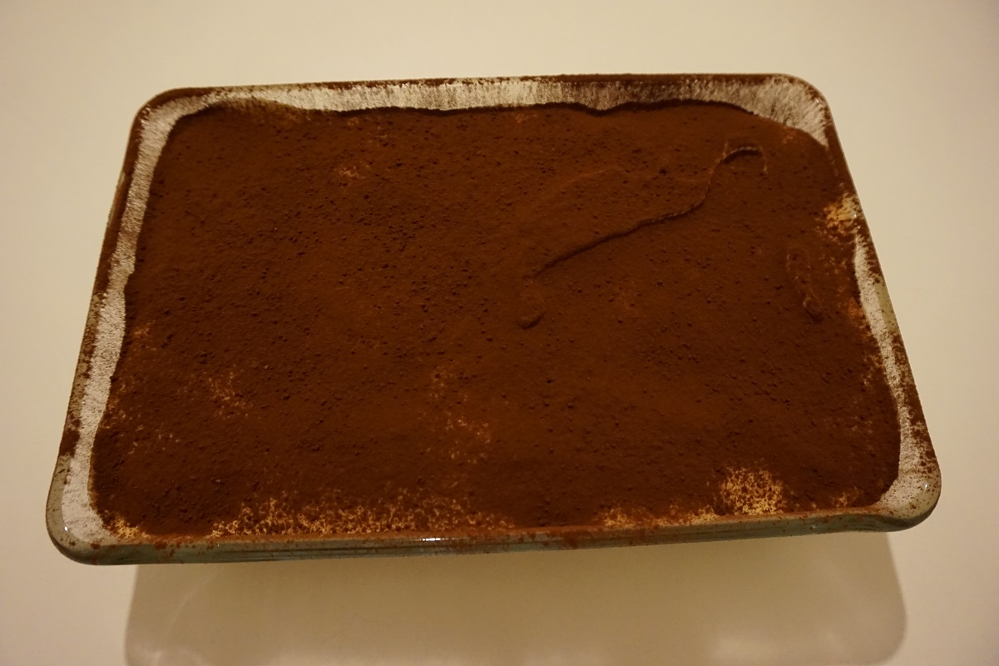

**Ingredienti per una teglia (6 persone):**

- 250 g di mascarpone
- 2 uova freschissime
- 4 1/2 cucchiai di zucchero per la crema
- 2 cucchiaini di zucchero per il caffè
- Un goccio di limone
- 200 ml di panna fredda
- 1 pizzico di sale
- 2 cucchiai di Rum
- Savoiardi
- Caffè di una moca raffreddato
- Cacao in polvere amaro

 

**Procedimento:**

Per prima cosa separate gli albumi dai tuorli e poneteli in 2 ciotole distinte.

Sbattete gli albumi con un pizzico di sale con l'aiuto delle fruste elettriche. Dovete montarli a neve ben ferma: quando rovesciate la ciotola sotto-sopra la massa non si muoverà. In una bacinella sbattete i tuorli d'uovo con lo zucchero e un goccio di limone finché la crema risulti spumosa e liscia. Aggiungeteci quindi un cucchiaio di rum e il mascarpone, continuate ad amalgamare affinché la crema risulti omogenea. Montare quindi la panna ben fredda in un altro recipiente.

Ora aggiungete lentamente alla crema di mascarpone gli albumi, poco alla volta mescolando molto delicatamente dall'alto verso il basso. Fate lo stesso procedimento con la panna. Adesso la vostra crema è pronta!

Inzuppate per pochi istanti i savoiardi nel caffè freddo già zuccherato a vostro piacimento (circa 2 cucchiaini di zucchero) e mescolato con l'altro cucchiaio di rum. Consiglio importante: dovete inzuppare i savoiardi dalla parte non zuccherata solo per pochi secondi e dovrete disporli nella pirofila con il lato zuccherato verso il basso.

Disponete quindi il primo strato di savoiardi sulla pirofila, quindi uno strato di crema, poi ancora uno strato di savoiardi e terminate con l'ultimo strato di crema ben livellato. Ricoprite la pirofila con un foglio di pellicola trasparente e lasciatelo riposare in frigorifero per una notte.

Spolverizzate quindi la superficie con del cacao amaro in polvere setacciato.

Buon appetito!

